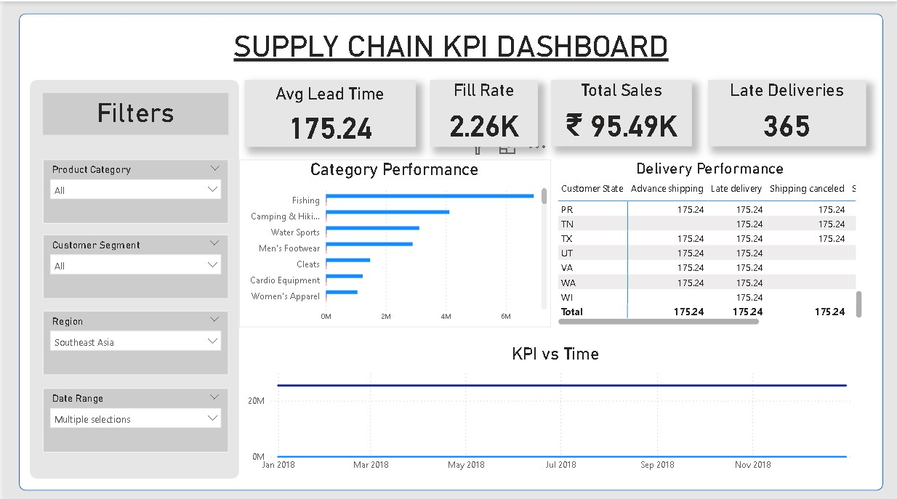

# 📦 Supply Chain KPI Dashboard

A streamlined end-to-end project for extracting, transforming, analyzing, and visualizing key performance indicators (KPIs) from a supply chain dataset using **Python (Pandas, SQLAlchemy, MySQL)** and **Power BI**.

---

## 📁 Project Structure

```
supply-chain-kpi-dashboard/
│
├── dataset/
│   └── cleaned_orders.csv           # Cleaned dataset
│
├── output/
│   └── kpis_final.csv               # Final KPI output
│
├── compute_kpis.py                 # Script to compute KPIs
├── A_digital_dashboard_layout.jpg  # Dashboard layout mockup
├── README.md                       # This file
```

---

## 🚀 Project Overview

This project demonstrates a mini end-to-end data analytics pipeline:

1. Loads a cleaned dataset into a MySQL database.
2. Calculates key KPIs using SQL.
3. Exports the computed KPIs into a final CSV.
4. Visualizes KPIs using Power BI or Tableau dashboards.

---

## 📊 Key Performance Indicators (KPIs)

| KPI                  | Description                                           |
|----------------------|-------------------------------------------------------|
| **Inventory Turnover** | Total Sales / Avg Order Quantity per category        |
| **Average Lead Time**  | Average of (Shipping Date - Order Date)              |
| **Fill Rate**          | Percentage of orders delivered on time               |

---

## 🛠️ Tech Stack

- **Python**: Data loading and processing (Pandas, SQLAlchemy)
- **MySQL**: Data storage and SQL KPI computation
- **Power BI / Tableau**: KPI visualization
- **Git**: Version control and collaboration

---

## 🧠 How to Use

### ✅ Step 1: Clone the Repository

```bash
git clone https://github.com/yourusername/supply-chain-kpi-dashboard.git
cd supply-chain-kpi-dashboard
```

### ✅ Step 2: Set Up MySQL

Create a MySQL database named `supply_chain`.

```sql
CREATE DATABASE supply_chain;
```

Update your database connection string in `compute_kpis.py`.

### ✅ Step 3: Install Python Dependencies

```bash
pip install pandas sqlalchemy pymysql
```

### ✅ Step 4: Run the Script

```bash
python compute_kpis.py
```

This will:
- Load `dataset/cleaned_orders.csv` into the MySQL table.
- Compute KPIs using SQL.
- Save results to `output/kpis_final.csv`.

### ✅ Step 5: Build the Dashboard

1. Open **Power BI** or **Tableau**.
2. Import the file `output/kpis_final.csv`.
3. Use `A_digital_dashboard_layout.png` for dashboard inspiration.

---

## 📷 Dashboard Layout Preview



---

## 📌 Future Enhancements

- 📈 Add monthly/quarterly KPI trends.
- ☁️ Host dashboard on Power BI Service.
- 🌐 Create a live web dashboard using Streamlit or Dash.
- 🔮 Implement forecasting models for demand/supply predictions.

---

## 👨‍💻 Author

- GitHub: [@yourusername](https://github.com/yourusername)
